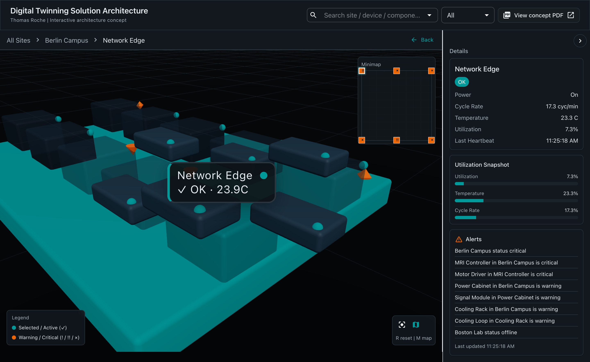

# Digital Twinning Solution Architecture

An interactive 3D digital twin interface for exploring operational health across sites, devices, and components. The application combines spatial navigation, simulated live telemetry, and hierarchical drill-downs to make a complex system architecture tangible and easy to inspect.

[Live demo](https://digital-twin-demo-blue.vercel.app/)  
[Architecture concept PDF](https://digital-twin-demo-blue.vercel.app/architecture-concept-and-roadmap-for-a-digital-twinning-solution.pdf)

## Preview



## Overview

This project presents a digital twinning experience designed around clarity, operational visibility, and system-level navigation. Rather than treating the architecture document and the interface as separate artifacts, the repo brings them together as one coherent product story.

The result is a lightweight but expressive experience for exploring fleet health, surfacing alerts, and moving from high-level system context down to component-level detail.

## Features

- 3D fleet overview spanning 6 sites, 60 devices, and 360 components
- drill-down navigation from site to device to component level
- simulated live telemetry with evolving status and metric updates
- search across sites, devices, and components
- status filtering for warning and critical states
- breadcrumb navigation, minimap, legend, and reset controls
- responsive layout for desktop and mobile
- direct access to the supporting architecture concept PDF from the UI

## Stack

- Next.js 15
- React 19
- TypeScript
- Material UI 7
- React Three Fiber + Drei
- Zustand

## Local development

```bash
npm install
npm run dev
```

Open [http://localhost:3000](http://localhost:3000).

## Interaction model

- Search for any site, device, or component from the top bar
- Use the status filter to focus on warnings or critical issues
- Click or tap entities in the scene to drill deeper
- Press `Esc` to move back up one level
- Press `R` to reset the camera
- Press `M` to toggle the minimap
- Use left and right arrow keys to cycle through entities at the current level

## Project structure

```text
app/                 Next.js app shell and global styles
components/scene/    3D scene, viewport, and rendered entities
components/ui/       Header, controls, legend, breadcrumbs, details panel
lib/                 Theme, status helpers, selectors, and mock data generation
store/               Zustand state and interaction logic
public/              Static assets, including the architecture concept PDF
```

## Notes

- The telemetry is simulated and deterministic, which keeps the experience stable while still feeling alive.
- The PDF in `public/` is part of the product story, not an afterthought.
- `package.json` remains `private: true` to prevent accidental npm publication. That does not affect publishing the code on GitHub.

## License

MIT
